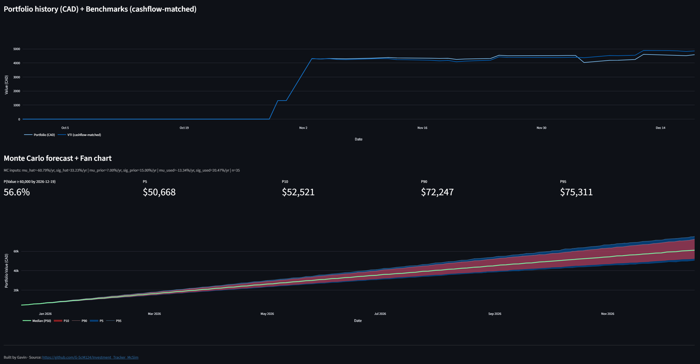

## Screenshot


# Portfolio Tracker + Monte Carlo (Streamlit)

A personal **investment tracker** + **benchmark comparison** + **Monte Carlo / fan chart** forecasting app built with **Streamlit**.

- Tracks holdings, ACB, realized & unrealized P/L (CAD)
- Optional dividend reinvestment (DRIP) *best-effort*
- Portfolio value history + **cashflow-matched** benchmarks
- Monte Carlo simulation with configurable priors + contributions (monthly deposits can be smoothed across business days)

> **Privacy note:** your spreadsheet is uploaded at runtime and is **not stored** by the repo. Do **not** commit your tracker `.xlsx` to GitHub.

> **Attribution** Feel free to use and modify for personal use. 
If you share screenshots/code or build on it publicly, please credit Gavin and link this repo. 
Please don’t repost it as your own work.

---

## Quick start (local)

### 1) Clone + create an environment
```bash
git clone https://github.com/G-ScM124/Investment_Tracker_McSim.git
cd Investment_Tracker_McSim

# Create & activate a virtual environment
python -m venv .venv

# Windows (PowerShell):
.\.venv\Scripts\Activate.ps1

# Windows (CMD):
.venv\Scripts\activate.bat

# macOS/Linux:
source .venv/bin/activate


### 2) Install dependencies
```bash
pip install -r requirements.txt
```

### 3) Run the app
```bash
streamlit run Tracker_MC_Sim.py
```

Then upload your tracker spreadsheet in the sidebar.

---

## Spreadsheet format

Your workbook must contain a sheet with these columns:

- **Group ID**
- **Ticker** (e.g., `VTI`, `SPY`, `VFV.TO`)
- **Fund Type**
- **Currency** (`CAD` or `USD`)
- **TT** (`BUY` or `SELL`)
- **Total Amount** (BUY: total paid; SELL: total proceeds received; positive numbers)
- **Shares**
- **Origin P/P** (trade price at time of entry; used as a last-resort fallback price)
- **Date** (Excel date column; display format doesn’t matter)

The app will warn you if any tickers contain leading/trailing spaces.

---

## Data sources (important)

### Prices & FX
- Primary: **Stooq** (daily prices)  
- Optional fallback: **yfinance** (only for tickers Stooq can’t fetch)
- FX (USD→CAD): Stooq `usdcad`

### Dividends / DRIP
- Dividends are fetched with **yfinance** and cached (best-effort).
- If Yahoo rate-limits you, turn off **DRIP** in the sidebar.

---

## Deploy (optional): Streamlit Community Cloud

You can deploy directly from GitHub. You’ll need at minimum:
- `Tracker_MC_Sim.py`
- `requirements.txt`

Streamlit will install dependencies from `requirements.txt` when building the app.
